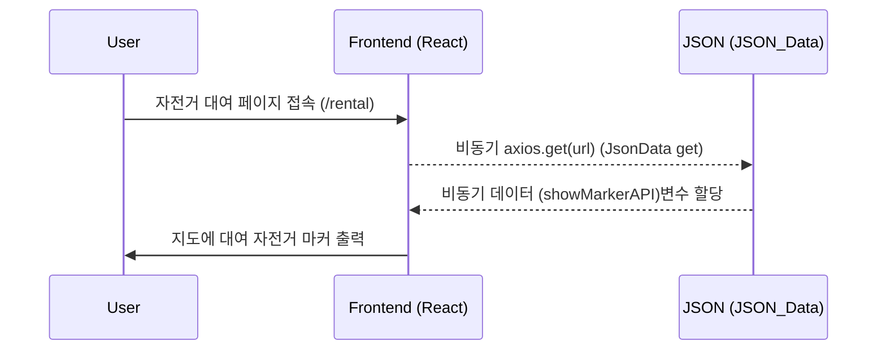
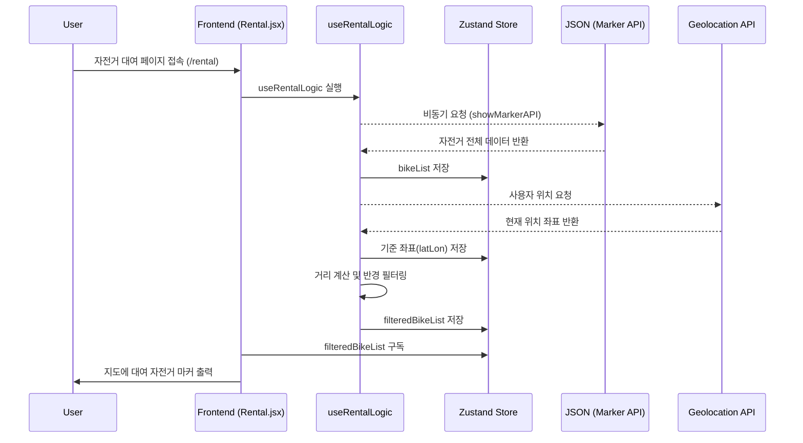

1. 대여 자전거 마커 출력

```mermaid
sequenceDiagram
    participant User
    participant Frontend as Frontend (React)
    participant JSON as JSON (JSON_Data)

    User ->> Frontend: 자전거 대여 페이지 접속 (/rental)
    Frontend -->> JSON: 비동기 axios.get(url) (JsonData get)
    JSON -->> Frontend: 비동기 데이터 (showMarkerAPI)변수 할당
    Frontend ->> User: 지도에 대여 자전거 마커 출력
```

1. 대여 자전거 마커 출력

```mermaid
sequenceDiagram
    participant User
    participant Frontend as Frontend (Rental.jsx)
    participant Logic as useRentalLogic
    participant Store as Zustand Store
    participant API as JSON (Marker API)
    participant GPS as Geolocation API

    User ->> Frontend: 자전거 대여 페이지 접속 (/rental)

    Frontend ->> Logic: useRentalLogic 실행

    Logic -->> API: 비동기 요청 (showMarkerAPI)
    API -->> Logic: 자전거 전체 데이터 반환
    Logic ->> Store: bikeList 저장

    Logic -->> GPS: 사용자 위치 요청
    GPS -->> Logic: 현재 위치 좌표 반환
    Logic ->> Store: 기준 좌표(latLon) 저장

    Logic ->> Logic: 거리 계산 및 반경 필터링
    Logic ->> Store: filteredBikeList 저장

    Frontend ->> Store: filteredBikeList 구독
    Frontend ->> User: 지도에 대여 자전거 마커 출력
```