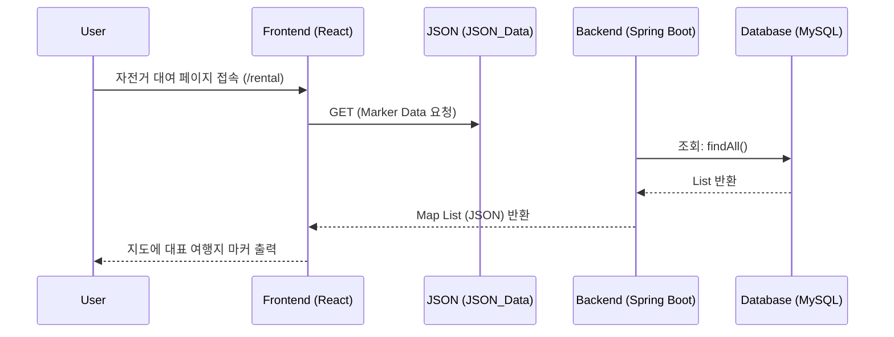

#[List]
1. 대여 자전거 마커 출력

```mermaid
sequenceDiagram
    participant User
    participant Frontend as Frontend (React)
    participant JSON as JSON (JSON_Data)
    participant Backend as Backend (Spring Boot)
    participant DB as Database (MySQL)

    User->>Frontend: 자전거 대여 페이지 접속 (/rental)
    Frontend ->> JSON: GET (Marker Data 요청)
    Backend->>DB: 조회: findAll()
    DB-->>Backend: List 반환
    Backend-->>Frontend: Map List (JSON) 반환    
    Frontend-->>User: 지도에 대표 여행지 마커 출력
```